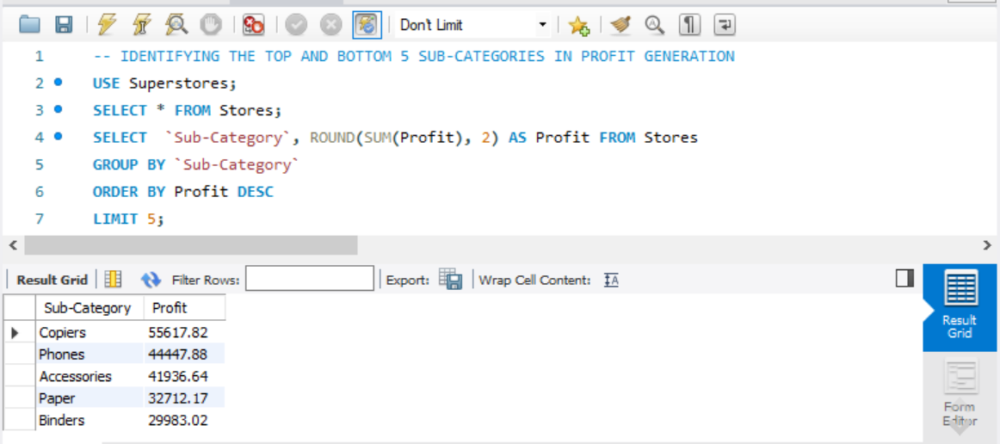
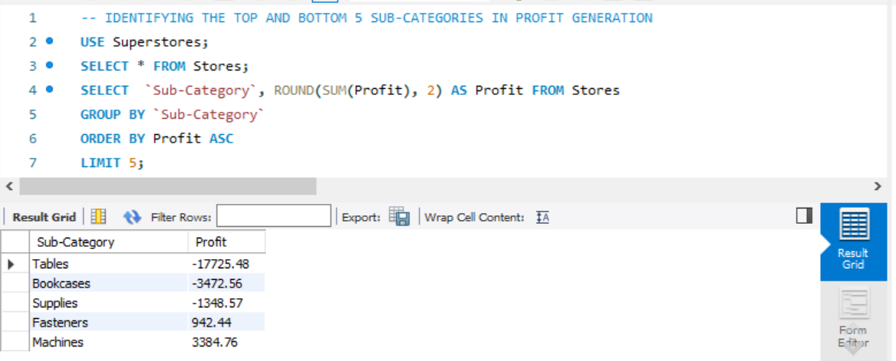
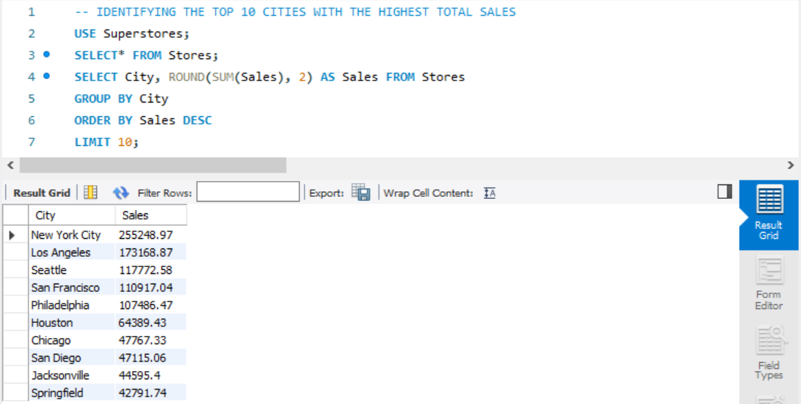
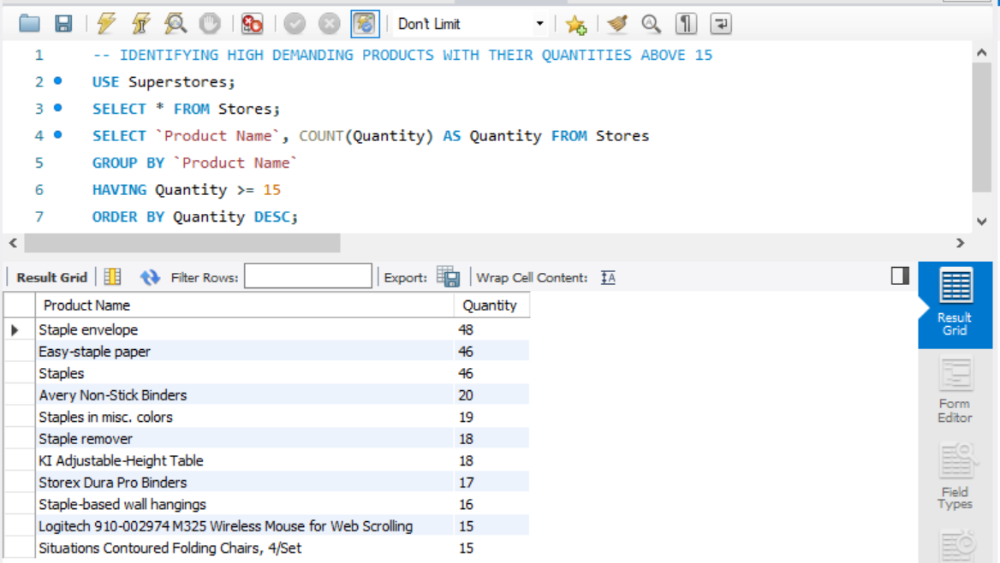
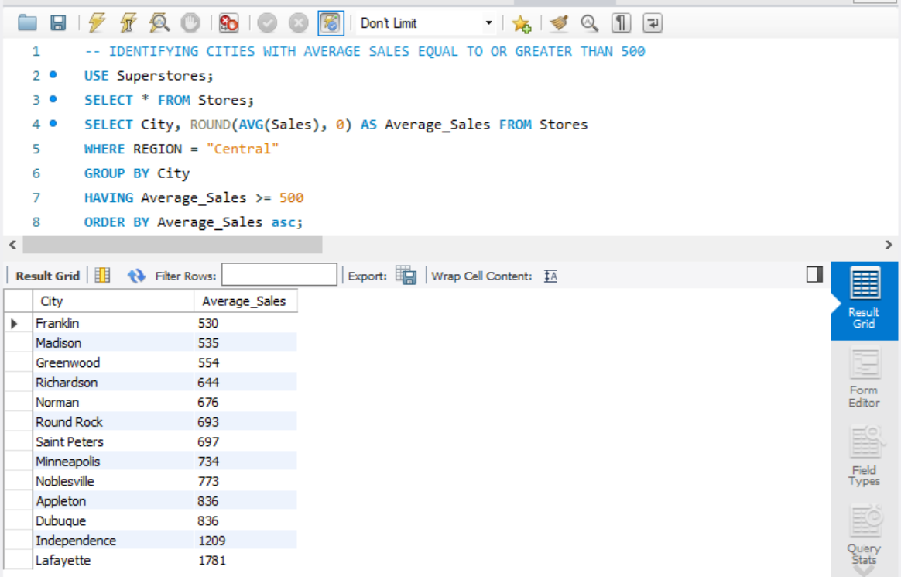
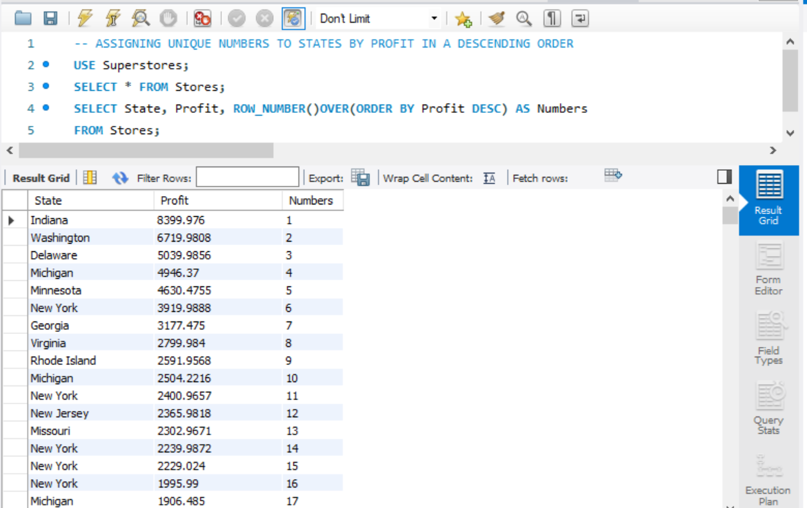
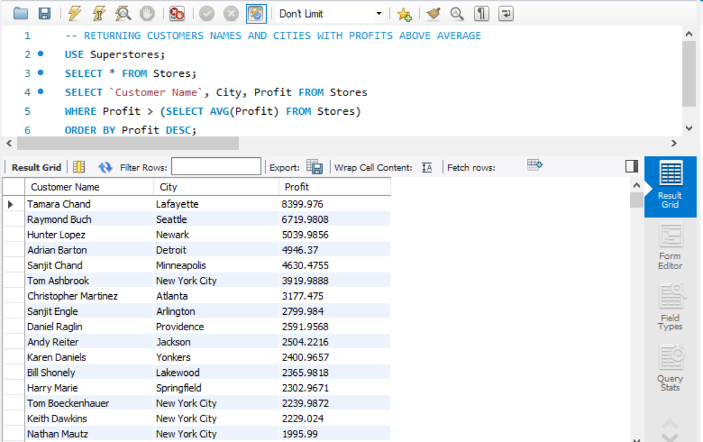
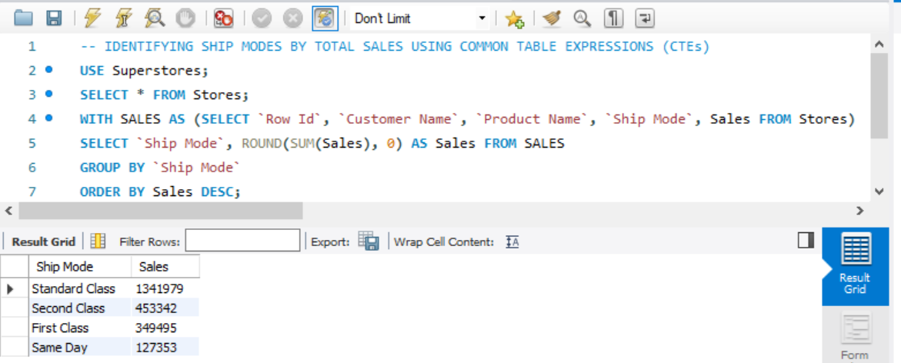
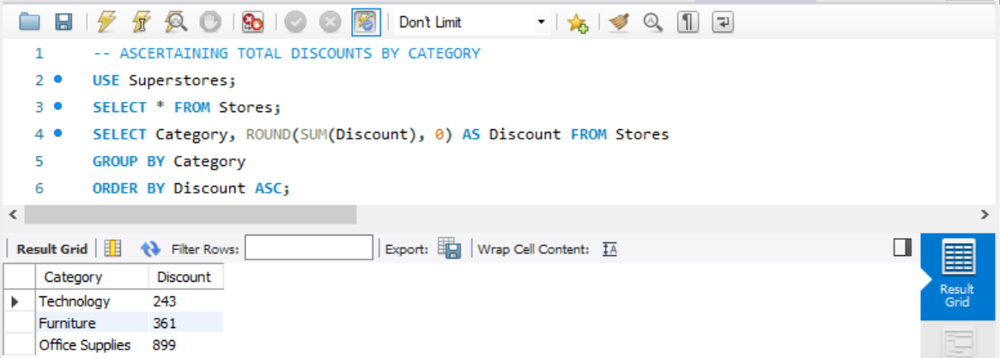

# SUPERSTORE PROFIT ANALYSIS

## INTRODUCTION

This project is an innovative data analytics project designed to unravel key insights from our business dataset comprising 9994 rows of information. In this project, we aim to delve into various aspects of our sales and customer data to uncover valuable information that will guide strategic decisions. Our focus areas include pinpointing the top 5 most profitable customers in the west region, identifying the highest and lowest performing sub-categories in terms of profit, determining the top 10 cities with the highest total sales, recognizing high-demand products, and much more. By leveraging advanced analytics, we are on a mission to empower decision-makers with actionable intelligence, facilitating a deeper understanding of our business landscape and driving success in the competitive market. Join us on this journey as we navigate through the data to reveal the insights that will shape our future success.

## PROBLEM STATEMENT

1. Ascertain the top 5 most profitable customers in the west region
2. Identify the top and bottom 5 sub-categories in terms of profit generation
3. Determine the top 10 cities with the highest total sales
4. Identify high demanding products with quantities above 14
5. Identify cities in the central region with average sales equal to or greater than 500
6. Assign unique numbers to states based on profit in descending order
7. Return customer names and cities with profits above the average
8. Identify ship modes by total sales using Common Table Expressions (CTEs)
9. Ascertain the total discounts by category
10. Determine the top 5 customers with the highest number of discounts

## SKILLS AND CONCEPTS TO BE DEMONSTRATED

- Database Querying
- Data Aggregation
- Data Filtering
- Sorting and Ordering
- Common Table Expressions (CTEs)
- Subqueries
- Grouping and Aggregating
- Window Functions

## ANALYSIS, DISCUSIIONS AND RESULTS

### 1. Ascertain The Top 5 Most Profitable Customers In The West Region:

To determine the top 5 most profitable customers in the west region, we will utilize SQL functionalities such as the SELECT statement, SUM aggregation, AS aliasing, WHERE clause for filtering, GROUP BY clause for grouping data, ORDER BY clause for sorting, and the LIMIT function to restrict the output to the top 5 results. The SQL syntax is as follows:

```sql
SELECT `Customer Name`, ROUND(SUM(Profit), 2) AS Profit FROM Stores
WHERE Region = "West"
GROUP BY `Customer Name`
ORDER BY Profit DESC
LIMIT 5;
```
Breaking down the syntax:
- SELECT Customer Name, ROUND(SUM(Profit), 2) AS Profit: This selects the customer names and calculates the total profit for each customer, rounding the result to two decimal places.
- FROM Stores: Specifies the source table as "Stores" from which the data is retrieved.
- WHERE Region = "West": Filters the data to include only records from the west region.
- GROUP BY Customer Name``: Groups the data by customer name, allowing the subsequent aggregation to be performed on individual customers.
- ORDER BY Profit DESC: Orders the results in descending order based on the calculated profit.
- LIMIT 5: Restricts the output to the top 5 results.

The result of this SQL query reveals that Raymond Buch is the highest and most profitable customer in the west region, with a total profit of $6,807.09.


### 2. Identify The Top and Bottom 5 Sub-Categories In Terms Of Profit Generation:

To identify the top and bottom 5 sub-categories in terms of profit generation, we utilize SQL functionalities, including the SELECT statement, SUM aggregation, AS aliasing, GROUP BY clause for grouping data, ORDER BY clause for sorting, and the LIMIT function to restrict the output to the desired number of results. The SQL syntax is as follows:

```sql
Top 5 Sub-Categories:
SELECT `Sub category`, ROUND(SUM(Profit), 2) AS Profit
FROM Stores
GROUP BY `Sub Category`
ORDER BY Profit DESC
LIMIT 5;

Bottom 5 Sub-Categories:
SELECT `Sub category`, ROUND(SUM(Profit), 2) AS Profit
FROM Stores
GROUP BY `Sub Category`
ORDER BY Profit ASC
LIMIT 5;
```
Breaking down the syntax:
- SELECT Sub category, ROUND(SUM(Profit), 2) AS Profit: This selects the sub-category names and calculates the total profit for each sub-category, rounding the result to two decimal places.
- FROM Stores: Specifies the source table as "Stores" from which the data is retrieved.
- GROUP BY Sub Category``: Groups the data by sub-category, allowing the subsequent aggregation to be performed on individual sub-categories.
- ORDER BY Profit DESC or ORDER BY Profit ASC: Orders the results in descending (for the top 5) or ascending (for the bottom 5) order based on the calculated profit.
- LIMIT 5: Restricts the output to the top or bottom 5 results.

The result of this SQL query reveals that the "Copiers" sub-category is the highest profitable, with a total profit of $55,617.82, while the "Tables" sub-category is the least profitable, with a total profit of -$17,725.48.

TOP 5 SUB-CATEGORY        | BOTTOM 5 SUB-CATEGORY
:------------------------:|:----------------------:
         |  


### 3.  Determine The Top 10 Cities with the highest total sales

To identify the top 10 cities with the highest total sales, we employ various SQL functionalities, including the SELECT statement, SUM aggregation, AS aliasing, GROUP BY clause for grouping data, ORDER BY clause for sorting, and the LIMIT function to restrict the output to the desired number of results. The SQL syntax is as follows:

```sql
SELECT City, ROUND(SUM(Sales), 2) AS Sales
FROM Stores
GROUP BY City
ORDER BY Sales DESC
LIMIT 10;
```
Breaking down the syntax:
- SELECT City, ROUND(SUM(Sales), 2) AS Sales: This selects the city names and calculates the total sales for each city, rounding the result to two decimal places.
- FROM Stores: Specifies the source table as "Stores" from which the data is retrieved.
- GROUP BY City: Groups the data by city, allowing the subsequent aggregation to be performed on individual cities.
- ORDER BY Sales DESC: Orders the results in descending order based on the calculated total sales.
- LIMIT 10: Restricts the output to the top 10 results.

The result of this SQL query reveals that New York City is the top-ranked city with the highest total sales of $255,248.97. This information provides valuable insights into the cities contributing the most to overall sales, aiding in strategic business planning and resource allocation.



### 4.  Identify High Demandibg Products With Quantities Above 14:

To determine products with quantities exceeding 14, we will utilize various SQL functionalities, including the SELECT statement, COUNT aggregation, AS aliasing, GROUP BY clause for grouping data, HAVING clause for filtering grouped results, and ORDER BY clause for sorting. The SQL syntax is as follows:

```sql
SELECT Product, COUNT(Quantity) AS Quantity
FROM Stores
GROUP BY Product
HAVING Quantity > 14
ORDER BY Quantity DESC;
```
Breaking down the syntax:
- SELECT Product, COUNT(Quantity) AS Quantity: This selects the product names and counts the occurrences of each product with quantities exceeding 14.
- FROM Stores: Specifies the source table as "Stores" from which the data is retrieved.
- GROUP BY Product: Groups the data by product, allowing the subsequent aggregation to be performed on individual products.
- HAVING Quantity > 14: Filters the grouped results to include only those products with a quantity greater than 14.
- ORDER BY Quantity DESC: Orders the results in descending order based on the count of quantities, showcasing products with the highest occurrences first.

The result of this SQL query presents a list of products and their corresponding quantities, focusing specifically on products with quantities exceeding 14. This information is valuable for inventory management, highlighting products that may be in higher demand or requiring special attention due to their higher quantities.



### 5. Identify Cities In The Central Region With Average Sales Equal_to  Or Greater Than 500:

To pinpoint cities in the central region with an average sales equal to or greater than $500, we will utilize several SQL functionalities, including the SELECT statement, AVG aggregation, AS aliasing, WHERE clause for filtering data, GROUP BY clause for grouping by city, HAVING clause for filtering grouped results, and ORDER BY clause for sorting. The SQL syntax is as follows:

```SQL
SELECT City, ROUND(AVG(Sales), 0) AS Average_Sales
FROM Stores
WHERE Region = "Central"
GROUP BY City
HAVING Average_Sales >= 500
ORDER BY Average_Sales DESC;
```
Breaking down the syntax:
- SELECT City, ROUND(AVG(Sales), 0) AS Average_Sales: This selects the city names and calculates the rounded average sales for each city.
- FROM Stores: Specifies the source table as "Stores" from which the data is retrieved.
- WHERE Region = "Central": Filters the data to include only records from the central region.
- GROUP BY City: Groups the data by city, allowing the subsequent aggregation to be performed on individual cities.
- HAVING Average_Sales >= 500: Filters the grouped results to include only those cities with an average sales value equal to or greater than $500.
- ORDER BY Average_Sales DESC: Orders the results in descending order based on the calculated average sales.

The result of this SQL query provides a list of cities in the central region with their respective average sales, focusing specifically on cities where the average sales meet or exceed the threshold of $500. This information is valuable for identifying high-performing cities in terms of sales within the specified region.



### 6. Assign Unique Numbers To States Based On Profit In Descending Order:

To allocate distinct numbers to states based on their profit in descending order, we utilize various SQL functionalities, including the SELECT statement, ROW_NUMBER() window function, ORDER BY clause for sorting, and AS aliasing. The SQL syntax is as follows:

```sql
SELECT State, Profit, ROW_NUMBER() OVER (ORDER BY Profit DESC) AS Numbers
FROM Stores;
```
Breaking down the syntax:
- SELECT State, Profit, ROW_NUMBER() OVER (ORDER BY Profit DESC) AS Numbers: This selects the state names, profit values, and assigns a unique row number to each state based on their profits in descending order.
- FROM Stores: Specifies the source table as "Stores" from which the data is retrieved.
- ROW_NUMBER() OVER (ORDER BY Profit DESC) AS Numbers: Utilizes the ROW_NUMBER() window function to generate a unique sequential number for each row, ordered by profit in descending order.

The result of this SQL query provides a list of states along with their respective profits and the assigned unique numbers. The numbers are assigned in descending order of profit, offering a ranking that reflects the profitability of each state. This information is valuable for prioritizing and categorizing states based on their financial performance.



### 7. Return Customer Names And Cities With Profits Above The Average:

To retrieve customer names and cities where profits exceed the average, we employ various SQL functionalities, including the SELECT statement, WHERE clause for filtering data, a SUB-QUERY encapsulating the AVG aggregation, and the ORDER BY clause for sorting. The SQL syntax is as follows:

```sql
SELECT `Customer Name`, City, Profit
FROM Stores
WHERE Profit > (SELECT AVG(Profit) FROM Stores)
ORDER BY Profit DESC;
```
Breaking down the syntax:
- SELECT Customer Name, City, Profit: This selects the customer names, cities, and profit values.
- FROM Stores: Specifies the source table as "Stores" from which the data is retrieved.
- WHERE Profit > (SELECT AVG(Profit) FROM Stores): Filters the data to include only records where the profit is greater than the overall average profit calculated using a subquery.
- ORDER BY Profit DESC: Orders the results in descending order based on the profit value.

The subquery (SELECT AVG(Profit) FROM Stores) calculates the average profit across all records in the "Stores" table. The main query then retrieves customer names, cities, and profits for records where the profit is higher than this calculated average.

The result of this SQL query provides a list of customer names, cities, and profits, focusing on those customers and cities where profits exceed the overall average. This information is useful for identifying high-performing customers and locations in terms of profitability.



### 8. Identify Ship Modes By Total Sales Using Common Table Expressions (CTEs):

To analyze ship modes based on total sales using Common Table Expressions (CTEs), we will employ the WITH clause, SELECT statement, GROUP BY clause, and ORDER BY clause. The SQL syntax is as follows:

```sql
WITH SALES AS (SELECT `Row ID`, `Customer Name`, `Product Name`, `Ship Mode`, Sales FROM stores)
SELECT `Ship Mode`, ROUND(SUM(Sales), 0) AS Sales FROM SALES
GROUP BY `Ship Mode`
ORDER BY Sales DESC;
```
Breaking down the syntax:
- WITH SALES AS (SELECT Row ID, Customer Name, Product Name, Ship Mode, Sales FROM stores): This creates a Common Table Expression (CTE) named "SALES," which is essentially a temporary table containing selected columns from the "stores" table.
- SELECT Ship Mode, ROUND(SUM(Sales), 0) AS Sales FROM SALES: This then selects the ship mode and the rounded sum of sales from the "SALES" CTE.
- GROUP BY Ship Mode: Groups the data by ship mode, allowing the subsequent aggregation to be performed on individual ship modes.
- ORDER BY Sales DESC: Orders the results in descending order based on the calculated total sales.

The result of this SQL query provides a breakdown of ship modes along with their respective total sales. In this specific task, the output reveals that the "Standard Class" ship mode has the highest total sales, while the "Same Day" ship mode has the lowest total sales. This information is valuable for evaluating the performance of different shipping modes in terms of sales.



### 9. Ascertain The Total Discounts By Category:

To determine the total discounts for each category, we will utilize SQL functionalities, including the SELECT statement, SUM aggregation, GROUP BY clause for grouping data by category, and the ORDER BY clause for sorting. The SQL syntax is as follows:

```sql
SELECT Category, ROUND(SUM(Discount), 0) AS Discount
FROM Stores
GROUP BY Category
ORDER BY Discount ASC;
```
Breaking down the syntax:
- SELECT Category, ROUND(SUM(Discount), 0) AS Discount: This selects the category names and calculates the rounded sum of discounts for each category.
- FROM Stores: Specifies the source table as "Stores" from which the data is retrieved.
- GROUP BY Category: Groups the data by category, allowing the subsequent aggregation to be performed on individual categories.
- ORDER BY Discount ASC: Orders the results in ascending order based on the calculated total discounts.

The result of this SQL query provides a summary of total discounts for each product category. The output indicates that the "Technology" category has a total discount of $243, the "Furniture" category has a total discount of $361, and the "Office Supplies" category has a total discount of $899. This information is useful for assessing the overall discount impact across different product categories.



### 10. Determine The Top 5 Customers With The Highest Number of Discounts:

To identify the top 5 customers with the highest number of discounts, we leverage SQL functionalities, including the SELECT statement, COUNT aggregation, GROUP BY clause for grouping data by customer, ORDER BY clause for sorting, and the LIMIT function to restrict the output to the desired number of results. The SQL syntax is as follows:

```sql
SELECT `Customer Name`, COUNT(Discount) AS Discount
FROM Stores
GROUP BY `Customer Name`
ORDER BY Discount DESC
LIMIT 5;
```
Breaking down the syntax:
- SELECT Customer Name, COUNT(Discount) AS Discount: This selects the customer names and counts the number of discounts for each customer.
- FROM Stores: Specifies the source table as "Stores" from which the data is retrieved.
- GROUP BY Customer Name: Groups the data by customer name, allowing the subsequent aggregation to be performed on individual customers.
- ORDER BY Discount DESC: Orders the results in descending order based on the count of discounts.
- LIMIT 5: Restricts the output to the top 5 results.

The result of this SQL query provides a list of the top 5 customers with the highest number of discounts, showcasing their names and the respective count of discounts each has received. This information is valuable for identifying customers who frequently benefit from discounts and may help in tailoring future promotional strategies.


