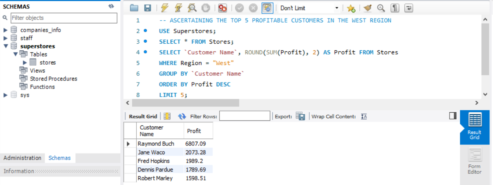

# SUPERSTORE PROFIT ANALYSIS

## INTRODUCTION

This project is an innovative data analytics project designed to unravel key insights from our business dataset comprising 9994 rows of information. In this project, we aim to delve into various aspects of our sales and customer data to uncover valuable information that will guide strategic decisions. Our focus areas include pinpointing the top 5 most profitable customers in the west region, identifying the highest and lowest performing sub-categories in terms of profit, determining the top 10 cities with the highest total sales, recognizing high-demand products, and much more. By leveraging advanced analytics, we are on a mission to empower decision-makers with actionable intelligence, facilitating a deeper understanding of our business landscape and driving success in the competitive market. Join us on this journey as we navigate through the data to reveal the insights that will shape our future success.

## PROBLEM STATEMENT

1. Ascertain the top 5 most profitable customers in the west region
2. Identify the top and bottom 5 sub-categories in terms of profit generation
3. Determine the top 10 cities with the highest total sales
4. Identify products with quantity above 15
5. Identify cities with average sales equal to or greater than 500
6. Assign unique numbers to states based on profit in descending order
7. Return customer names and cities with profits above the average
8. Identify ship modes by total sales using Common Table Expressions (CTEs)
9. Ascertain the total discounts by category
10. Determine the top 5 customers with the highest number of discounts

## SKILLS AND CONCEPTS TO BE DEMONSTRATED

- Database Querying
- Data Aggregation
- Data Filtering
- Sorting and Ordering
- Common Table Expressions (CTEs)
- Subqueries
- Grouping and Aggregating
- Window Functions

## ANALYSIS, DISCUSIIONS AND RESULTS

### 1. Ascertain The Top 5 Most Profitable Customers In The West Region:

To determine the top 5 most profitable customers in the west region, we will utilize SQL functionalities such as the SELECT statement, SUM aggregation, AS aliasing, WHERE clause for filtering, GROUP BY clause for grouping data, ORDER BY clause for sorting, and the LIMIT function to restrict the output to the top 5 results. The SQL syntax is as follows:

```sql
SELECT `Customer Name`, ROUND(SUM(Profit), 2) AS Profit FROM Stores
WHERE Region = "West"
GROUP BY `Customer Name`
ORDER BY Profit DESC
LIMIT 5;
```
Breaking down the syntax:
- SELECT Customer Name, ROUND(SUM(Profit), 2) AS Profit: This selects the customer names and calculates the total profit for each customer, rounding the result to two decimal places.
- FROM Stores: Specifies the source table as "Stores" from which the data is retrieved.
- WHERE Region = "West": Filters the data to include only records from the west region.
- GROUP BY Customer Name``: Groups the data by customer name, allowing the subsequent aggregation to be performed on individual customers.
- ORDER BY Profit DESC: Orders the results in descending order based on the calculated profit.
- LIMIT 5: Restricts the output to the top 5 results.

The result of this SQL query reveals that Raymond Buch is the highest and most profitable customer in the west region, with a total profit of $6,807.09.



### 2. Identify The Top and Bottom 5 Sub-Categories In Terms Of Profit Generation:


